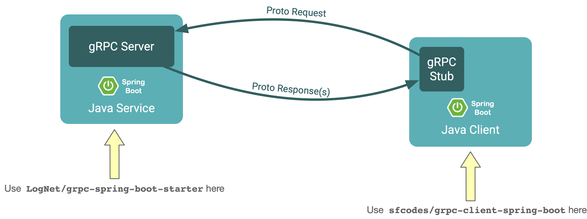

image:https://circleci.com/gh/sfcodes/grpc-client-spring-boot/tree/develop.svg?style=shield["CircleCI", link="https://circleci.com/gh/sfcodes/grpc-client-spring-boot/tree/develop"]
image:https://codecov.io/gh/sfcodes/grpc-client-spring-boot/branch/develop/graph/badge.svg["Codecov", link="https://codecov.io/gh/sfcodes/grpc-client-spring-boot"]
image:https://maven-badges.herokuapp.com/maven-central/sfcodes/grpc-client-spring-boot/badge.svg?style=plastic["Maven Central", link="https://mvnrepository.com/artifact/codes.sf/grpc-client-spring-boot"]

= gRPC Client for Spring Boot

Spring Boot library for auto-configuring https://github.com/grpc/grpc-java[gRPC Java stubs].

This library will automatically scan the classpath, find all gRPC stub classes, instantiate them, and register them as
beans with the ApplicationContext; allowing for easy `@Autowire` and injecting them just like you would any other Spring
bean. For example:

```java
@RestController
public class GreeterController {

    @Autowired  // <===== gRPC stub is autowired!
    private GreeterGrpc.GreeterBlockingStub greeterStub;

    @RequestMapping(value = "/sayhello")
    public String sayHello(@RequestParam String name) {
        HelloRequest request = HelloRequest.newBuilder().setName(name).build();
        HelloReply reply = greeterStub.sayHello(request);
        return reply.getMessage();
    }
}

```

If you're completely new to gRPC, start by going through the
https://grpc.io/docs/tutorials/basic/java.html[gRPC Basics for Java] tutorial first. Then come back here to learn how to
integrate gRPC stubs with Spring.

====
This library requires *Spring Framework 5.x* and *Spring Boot 2.x*. If you would like to see this backported to Spring
Framework 4.x and Spring Boot 1.x, please upvote
https://github.com/sfcodes/grpc-client-spring-boot/issues/1[this issue].
====

==== Maven

For Maven users, in your pom.xml file, add between `<dependencies> ... </dependencies>`
```xml
<dependency>
    <groupId>codes.sf</groupId>
    <artifactId>grpc-client-spring-boot</artifactId>
    <version>0.0.2</version>
</dependency>
```

==== Gradle

For Gradle users, add the following in your build.gradle file:
```groovy
repositories {
    mavenCentral()
}

dependencies {
    compile group: 'codes.sf', name: 'grpc-client-spring-boot', version: '0.0.2'
}
```

== Usage

By default, without any user configuration, this library will scan for gRPC stubs in the same packages already
specified in your `@SpringBootApplication` and `@ComponentScan` annotations. Instantiated stubs will use a default
plaintext _channel_ with target `localhost:6565`.


==== Scan Packages

If your stubs are not in the same package as your Spring Boot app, you can configure alternative packages to scan with
property:
```yaml
grpc:
    client:
        scanPackages: io.grpc.examples
```

Or you can use the more sophisticated annotation form:
```java
@GrpcStubScan(basePackages = "io.grpc.examples")
public class MyGrpcConfiguration {
}
```

If both are present, the annotation will override the property.

==== Channel

By default, a plaintext `localhost:6565` channel is used for all stub instances. To configure a different target,
use property:

```yaml
grpc:
    client:
        target: example.com:8080
```

For a more sophisticated channel configuration, you can declare your own channel bean:
```java
@Configuration
public class MyGrpcConfiguration {
    @Bean
    public Channel channel() {
        return ManagedChannelBuilder
                .forAddress("grpc.example.com", 443)
                .useTransportSecurity()
                .enableRetry()
                .build();
    }
}
```

If you require different channels for different stubs, you can declare a `GrpcChannelSource` bean:
```java
@Configuration
public class MyGrpcConfiguration {
    @Bean
    public GrpcChannelSource channelSource() {
        return stubClass -> {
            String serviceName = stubClass.getCanonicalName().toLowerCase();
            return ManagedChannelBuilder
                    .forAddress(serviceName + ".local", 8080)
                    .usePlaintext()
                    .build();
        };
    }
}
```

GrpcChannelSource is where your _service discovery_ logic should go, routing stubs to their implementations.

==== Executor

By default gRPC uses it's own `Executor` instance for asynchronous operations. You can however switch to using the
_Spring_ executor with this property:
```yaml
grpc:
    client:
        springexecutor: true
```

==== Compression

You may set the compression to use for calls:
```yaml
grpc:
    client:
        compression: gzip
```

Note however that the compression set here is used by the stub to compress messages _to_ the server. To get compressed
responses _from_ the server, you will need to set the appropriate decompressor registry on the channel.

==== Max Message Sizes

You can set the maximum allowed _inbound_ (from the server) and _outbound_ (to the server) message sizes in bytes,
with properties:
```yaml
grpc:
    client:
        maxInboundMessageSize: 2048
        maxOutboundMessageSize: 1024
```

===== Client Interceptors

You may register https://grpc.io/grpc-java/javadoc/io/grpc/ClientInterceptor.html[client interceptors] as Spring beans
and they will automatically be applied to all stub calls. You may order these interceptors using Spring's order
https://docs.spring.io/spring-framework/docs/current/javadoc-api/org/springframework/core/annotation/Order.html[annotation]
or https://docs.spring.io/spring-framework/docs/current/javadoc-api/org/springframework/core/Ordered.html[interface].

```java
@Configuration
public class MyGrpcConfiguration {

    @Order(Ordered.HIGHEST_PRECEDENCE)
    @Bean
    public ClientInterceptor clientInterceptorB() {
        return new ClientInterceptor() {
            @Override
            public <ReqT, RespT> ClientCall<ReqT, RespT> interceptCall(
                    MethodDescriptor<ReqT, RespT> method,
                    CallOptions callOptions,
                    Channel next) {

                // For example add credentials to the call
                callOptions = callOptions.withCallCredentials(myCallCredentials);

                return next.newCall(method, callOptions));
            }
        };
    }
}
```

==== Stub Post Processors

gRPC _stub post processors_ are factory hooks for custom modification of the new gRPC stub instances before they are
ready for use. Use post processors if you require further fine tuning not already exposed by the properties documented
above.

Stub post processors are registered as Spring beans, can be ordered, and will automatically be detected and applied to
the newly created stub instances. Example registration:

```java
@Configuration
public class MyGrpcConfiguration {
    @Bean
    public GrpcStubPostProcessor postProcessor() {
        return stub -> {
            return stub.withOption(myCustomOptionKey, myCustomOption);
        };
    }
}
```

`GrpcStubPostProcessor` can generically declare the stub type that it is interested in, in which case the processor will
only be invoked on the matching stub instances; for example the following post processor will only apply to
`GreeterBlockingStub`, it will _not_ apply to `GreeterStub`, `GreeterFutureStub`, or any other stub:

```java
@Configuration
public class MyGrpcConfiguration {

    @Bean
    public GrpcStubPostProcessor<GreeterBlockingStub> postProcessor() {
        return new GrpcStubPostProcessor<GreeterBlockingStub>() {
            @Override
            public GreeterBlockingStub postProcess(GreeterBlockingStub stub) {
                return stub.withDeadlineAfter(1, TimeUnit.DAYS);
            }
        };
    }
}
```
_Warning, due to Spring issue https://jira.spring.io/browse/SPR-13698[SPR-13698], you can not use lambda's to
define generically-declared post processors, they will not work._

If you require more control over deciding which stubs to process, consider using interface
`GenericGrpcStubPostProcessor` instead.

== What about _LogNet/grpc-spring-boot-starter_ ?

If you Googled _"spring grpc"_, you probably found this library and
https://github.com/LogNet/grpc-spring-boot-starter[LogNet/grpc-spring-boot-starter], and now wondering why are there
_two_ different libraries for integrating gRPC with Spring?

Answer is, the two library actually do two different things:

- This library integrates gRPC *stubs* with
Spring Boot, which means it should be used by Spring Boot apps that are gRPC *clients*.
- https://github.com/LogNet/grpc-spring-boot-starter[LogNet/grpc-spring-boot-starter] integrates gRPC service
*implementations* with Spring Boot, which means it should be used by Spring Boot apps that are gRPC *servers*.

It might be the case that your app both consumes gRPC stubs, and implements gRPC services, in which case you should use
both of these libraries in your app; they're totally compatible with each other.


